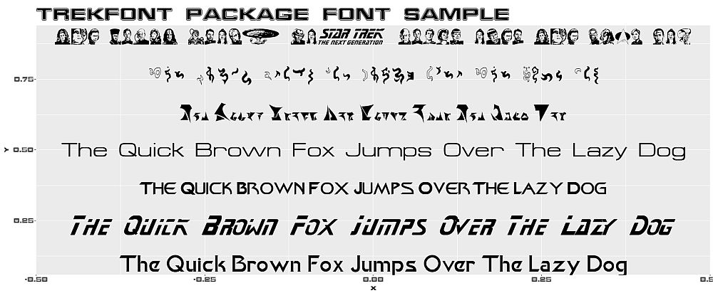

<!-- README.md is generated from README.Rmd. Please edit that file -->

# trekfont 

<!-- badges: start -->
[](https://www.repostatus.org/)
[](https://github.com/leonawicz/trekfont/actions/workflows/R-CMD-check.yaml)
[](https://app.codecov.io/gh/leonawicz/trekcolors)
[](https://CRAN.R-project.org/package=trekfont)
[](https://cran.r-project.org/package=trekfont) 
[](https://github.com/leonawicz/trekfont)
<!-- badges: end -->

This package contains true type and open type Star Trek fonts.


## Installation

Install `trekfont` from CRAN with

``` r
install.packages("trekfont")
```

Install the development version from GitHub with

``` r
# install.packages("remotes")
remotes::install_github("leonawicz/trekfont")
```

## Examples

`trekfonts` contains one dataset, `trekfonts`, which is just a character vector of all 107 available font files.

Font files can be installed using the [sysfonts](https://CRAN.R-project.org/package=sysfonts) package.

Here are some examples, leveraging `sysfonts` and `showtext`.

```{r font_setup, eval=FALSE}
# install.packages("trekfont")
library(showtext)
font <- c("Khan", "StarNext", "FederationDS9Title", "Federation", "Klingon", "ModernVulcan", "TNGcast", "FederationStarfleet")
path <- system.file(paste0("fonts/", font, ".ttf"), package = "trekfont")
for(i in seq_along(font)) font_add(font[i], path[i])
font_families()
showtext_auto()
```

Use base graphics...

```{r font_plot, eval=FALSE}
y <- seq(0.1, 0.9, length.out = 7)
txt <- "The Quick Brown Fox Jumps Over The Lazy Dog"
plot(0, 0, type = "n", ylim = c(0, 1), main = "trekfont package font sample", family = font[8])
for(i in 1:7) text(0, y[i], txt, family = font[i])
```

or ggplot2...

```{r font_ggplot, eval=FALSE}
library(ggplot2)
g <- ggplot() + theme_gray(base_family = font[8]) + ggtitle("trekfont package font sample")
for(i in 1:7) g <- g + annotate("text", 0, y[i], label = txt, family = font[i], size = 12.5)
g
```



Did you ever think you would be annotating your plots in Vulcan and Klingon?

The [rtrek](https://github.com/leonawicz/rtrek) package does not import `trekfont`, but it does provide a convenient wrapper function, `rtrek::st_font()`, for previewing the various fonts if `trekfont` is installed. This is the example plot shown at the top.

## Packages in the trekverse

<div class="row">
<div class="col-sm-2">
<a href="https://github.com/leonawicz/rtrek"></a>
</div>
<div class="col-sm-10">
<h4 style="padding:30px 0 0 0;margin-top:5px;margin-bottom:5px;"><a href="https://github.com/leonawicz/rtrek">rtrek</a>: The core Star Trek package</h4>
Datasets related to Star Trek, API wrappers to external data sources, and more.
</div></div>
<br/>
<div class="row">
<div class="col-sm-2">
<a href="https://github.com/leonawicz/lcars"></a>
</div>
<div class="col-sm-10">
<h4 style="padding:30px 0 0 0;margin-top:5px;margin-bottom:5px;"><a href="https://github.com/leonawicz/lcars">lcars</a>: LCARS aesthetic for Shiny</h4>
Create Shiny apps based on the Library Computer Access/Retrieval System (LCARS).
</div></div>
<br/>
<div class="row">
<div class="col-sm-2">
<a href="https://github.com/leonawicz/trekcolors"></a>
</div>
<div class="col-sm-10">
<h4 style="padding:30px 0 0 0;margin-top:5px;margin-bottom:5px;"><a href="https://github.com/leonawicz/trekcolors">trekcolors</a>: A color palette package</h4>
Predefined and customizable Star Trek themed color palettes and related functions.
</div></div>
<br/>
<div class="row">
<div class="col-sm-2">
<a href="https://github.com/leonawicz/trekfont"></a>
</div>
<div class="col-sm-10">
<h4 style="padding:30px 0 0 0;margin-top:5px;margin-bottom:5px;"><a href="https://github.com/leonawicz/trekfont">trekfont</a>: A fonts package</h4>
True (Trek) type fonts to style your Star Trek themed graphics text.
</div></div>

<br>

## Citation

Matthew Leonawicz (`r substr(Sys.Date(), 1, 4)`). trekfont: Star Trek Fonts Collection. R package version 0.9.6. https://CRAN.R-project.org/package=trekfont

## Contribute

Contributions are welcome. Contribute through GitHub via pull request. Please create an issue first if it is regarding any substantive feature add or change.

---

Please note that the `trekfont` project is released with a [Contributor Code of Conduct](https://github.com/leonawicz/trekfont/blob/master/CODE_OF_CONDUCT.md). By contributing to this project, you agree to abide by its terms.
