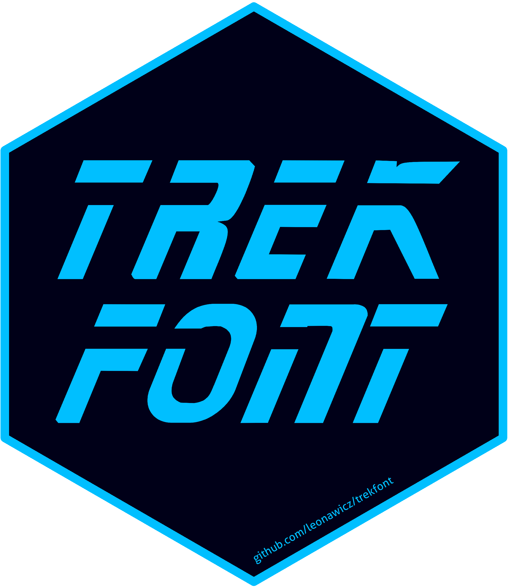

<!-- README.md is generated from README.Rmd. Please edit that file -->

# trekfont 
**Author:** [Matthew Leonawicz](https://leonawicz.github.io/blog/) <a href="https://orcid.org/0000-0001-9452-2771" target="orcid.widget">
<image class="orcid" src="https://members.orcid.org/sites/default/files/vector_iD_icon.svg" height="16"></a>
<br/>
**License:** [MIT](https://opensource.org/licenses/GPL-3.0)<br/>

[](http://www.repostatus.org/#active)
[](https://travis-ci.org/leonawicz/trekfont)
[](https://ci.appveyor.com/project/leonawicz/trekfont)

[](https://cran.r-project.org/package=trekfont)
[](https://cran.r-project.org/package=trekfont) 
[](https://github.com/leonawicz/trekfont)

[](https://ko-fi.com/leonawicz)

This package contains true type and open type Star Trek fonts.


## Installation

Install `trekfont` from CRAN with

``` r
install.packages("trekfont")
```

Install the development version from GitHub with

``` r
# install.packages("remotes")
remotes::install_github("leonawicz/trekfont")
```


## Details

`trekfonts` contains one dataset, `trekfonts`, which is just a character vector of all 107 available font files.

Font files are located in the `inst` directory and can be installed using the [sysfonts](https://CRAN.R-project.org/package=sysfonts) package.

See this [simplified example](https://leonawicz.github.io/blog/post/trekfont-star-trek-themed-fonts-package/) with minimal use of other packages like `showtext` and `sysfonts` for loading and using these fonts.

The [rtrek](https://github.com/leonawicz/rtrek) package does not import `trekfont`, but it does provide a convenient wrapper function for previewing the various fonts if `trekfont` is installed.

## Packages in the trekverse

<div class="row">
<div class="col-sm-2">
<a href="https://github.com/leonawicz/rtrek"></a>
</div>
<div class="col-sm-10">
<h4 style="padding:30px 0 0 0;margin-top:5px;margin-bottom:5px;"><a href="https://github.com/leonawicz/rtrek">rtrek</a>: The core Star Trek package</h4>
Datasets related to Star Trek, API wrappers to external data sources, and more.
</div></div>
<br/>
<div class="row">
<div class="col-sm-2">
<a href="https://github.com/leonawicz/trekcolors"></a>
</div>
<div class="col-sm-10">
<h4 style="padding:30px 0 0 0;margin-top:5px;margin-bottom:5px;"><a href="https://github.com/leonawicz/trekcolors">trekcolors</a>: A color palette package</h4>
Predefined and customizable Star Trek themed color palettes and related functions.
</div></div>
<br/>
<div class="row">
<div class="col-sm-2">
<a href="https://github.com/leonawicz/trekfont"></a>
</div>
<div class="col-sm-10">
<h4 style="padding:30px 0 0 0;margin-top:5px;margin-bottom:5px;"><a href="https://github.com/leonawicz/trekfont">trekfont</a>: A fonts package</h4>
True (Trek) type fonts to style your Star Trek themed graphics text.
</div></div>

---

Please note that the `trekfont` project is released with a [Contributor Code of Conduct](https://github.com/leonawicz/trekfont/blob/master/CODE_OF_CONDUCT.md). By contributing to this project, you agree to abide by its terms.
